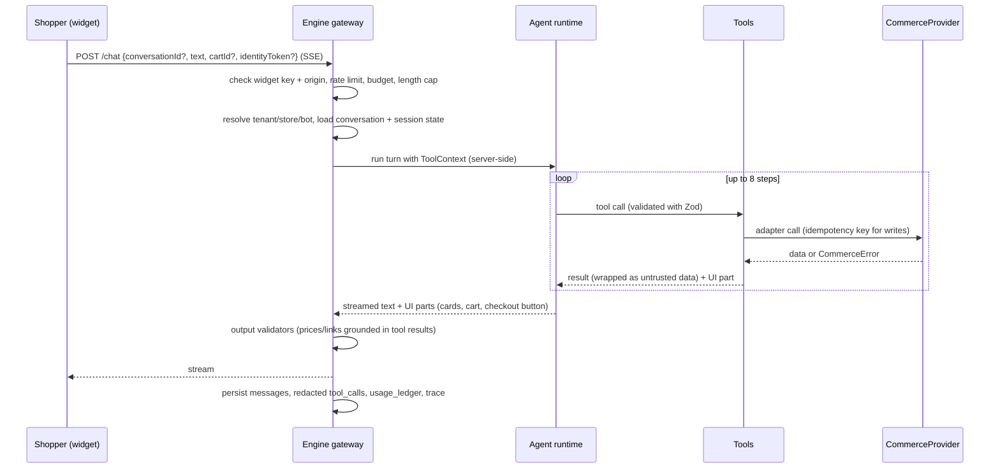
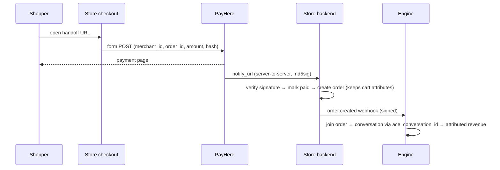

# ACE Start-to-End Workflow

How the AI Commerce Engine works from the moment a merchant signs up to the moment a shopper's order is delivered,
and how the system improves afterwards. Architecture details are in the
[design spec](superpowers/specs/2026-10-08-ai-commerce-engine-design.md). The build order is in the
[roadmap](superpowers/plans/2026-10-08-roadmap.md).

```text
 A. Onboard merchant ─► B. Sync & enrich catalog ─► C. Shopper conversation turn (every message)
                                                        │
        ┌───────────────────────────────────────────────┼──────────────────────────┐
        ▼                                               ▼                          ▼
 D. Discover → cart → checkout              I. Policy question (RAG)       H. Human handoff
        │                                                                          ▲
        ├─► E. COD order (confirmed)                                               │
        └─► F. Card payment + attribution ─► G. Post-purchase support ─────────────┘
                                                        │
                         J. Failure handling (any step)  ·  K. Data lifecycle  ·  L. Improvement loop
```

---

## A. Merchant onboarding (once per tenant)

| Step | Who | What happens | Done when |
|---|---|---|---|
| A1 | Us + merchant | Sign the service agreement and the **data-processing agreement** (merchant = controller, ACE = processor). Record languages, delivery regions, payment methods, COD rules and support hours. | Signed DPA on file |
| A2 | Us | Create `tenant`, `store` (platform + encrypted credentials) and `bot` (persona, models, languages, budget). | Rows exist; credentials verified by a `getProduct` smoke call |
| A3 | System | Pick the adapter from `store.platform` and run the **conformance smoke check** (read-only subset) against the live store. | All read capabilities pass |
| A4 | System | **Initial catalog sync** (flow B) → enrichment → embeddings. | 100% of active products indexed; enrichment report generated |
| A5 | Merchant | Review the enrichment report (colours, occasions, fabrics) and fix wrong attributes. | Merchant sign-off |
| A6 | Merchant | Upload knowledge: return/exchange policy, delivery times and charges, size guide, care instructions, FAQ, brand story. | Documents ingested and chunked |
| A7 | Us | Register webhooks on the platform (product/inventory/order events) pointing to `/webhooks/:storeId`. | Test event received and verified |
| A8 | Us + merchant | Run the **tenant acceptance eval**: generic golden conversations + 10 tenant-specific questions. Fix persona/knowledge until it passes. | ≥ 90% pass, no safety failures |
| A9 | Us | Issue a widget key, set allowed origins, give the install snippet `<script src=".../ace.js" data-key="pk_…" async></script>`. Storefront passes the cart ID and, if logged in, a signed identity token. | Widget visible on staging |
| A10 | Merchant | Soft launch (staff only) → public launch. Set up handoff notifications (email/WhatsApp to staff). | Live; dashboard shows conversations |

---

## B. Catalog sync and enrichment (continuous)

```mermaid
sequenceDiagram
  participant P as Store platform
  participant E as Engine /webhooks
  participant Q as pg-boss queue
  participant W as Worker
  participant DB as Postgres read model
  P->>E: product.updated (signed)
  E->>E: verify HMAC, dedupe by event id (webhook_events)
  E->>Q: enqueue sync.product {storeId, productId}
  E-->>P: 200 OK (fast)
  Q->>W: job
  W->>P: provider.getProduct(productId) (live, authoritative)
  W->>DB: upsert product + variants (price, stock status)
  alt text or images changed
    W->>Q: enqueue enrich.product + embed.product
  end
  Note over W,DB: Nightly reconciliation: listProducts(updatedSince=last_success)<br/>catches missed webhooks; weekly full resync marks deleted products
```

Rules:

- The webhook handler only verifies, dedupes and enqueues. It does no heavy work, so it can answer the platform quickly.
- Jobs are idempotent (upsert by `(tenant_id, product_id)`); retries are safe.
- Enrichment uses the cheap model to extract `{category, color[], pattern, fabric[], occasion[], fit, gender, season}`.
  Merchant overrides always win over model output.
- The index never decides a final price or stock answer (see C6).

---

## C. Shopper conversation turn (every message)



| Step | Detail |
|---|---|
| C1 | **Gateway:** publishable key → tenant; `Origin` must be on the allow-list; per-visitor and per-IP rate limits; message ≤ 2,000 chars; budget check. |
| C2 | **Consent:** the first message in a new conversation shows the privacy notice; consent is recorded. |
| C3 | **Context:** build `ToolContext` = tenant, store, provider instance, host `cartId`, `VerifiedIdentity` (from a signed token or an earlier OTP), locale, session state. **The model cannot set any of these.** |
| C4 | **Prompt:** safety core + tenant persona + store facts + conversation summary + recent messages. |
| C5 | **Tools:** only tools whose capabilities the adapter declares and the tenant enabled. |
| C6 | **Grounding:** prices, stock and links shown to the shopper come from tool results of this turn. Before add-to-cart and checkout, data is re-read live. |
| C7 | **Output checks:** amounts and URLs in the text must appear in tool results; otherwise the message is regenerated once, then the amount is replaced with the card. |
| C8 | **Persist and measure:** messages, redacted tool calls, tokens and cost, latency, outcome tags (`added_to_cart`, `checkout_started`, `handoff`, …). |

**Deterministic UI actions** (button clicks on cards: add to cart, change quantity, remove) call
`POST /actions/:type` directly. They use the same tools and the same `ToolContext`, but no LLM. The result is added to
the conversation as an event so the agent knows about it on the next turn.

---

## D. Sales journey: discover → choose → cart → checkout (worked example)

> Shopper: "I need a black dress for a wedding, under 20,000, size M"

1. **Normalise:** cheap model → `{ text: "black dress wedding", filters: { category: "dress", options: { color: ["Black"], size: ["M"] }, priceMax: 2000000, inStockOnly: true } }` (LKR minor units).
2. **Search:** `search_products` → top 3–5 summaries; session state stores them as `#1…#5`.
3. **Respond:** short text plus product cards rendered from tool data (image, title, price, stock badge).
4. > "Is #2 available in large too? What's the fabric?"
   → `get_product(#2)` + `check_availability` (live). Answer from data; fabric from product attributes or knowledge base.
5. > "OK, add #2 in M"
   → resolve `#2` + `size=M` → variant ID → `add_to_cart` into the **host cart** with idempotency key
   `turnId:toolCallId` and cart attribute `ace_conversation_id`. The widget emits `ace:cart-updated` and the site
   refreshes its cart badge.
6. **Upsell (one, optional, rule-based):** if the tenant enabled it, suggest one complementary in-stock item. Never more
   than one suggestion per turn and never after "no".
7. > "Checkout"
   → `start_checkout` re-validates the cart live (price/stock changes are explained) → returns the handoff URL → the
   widget shows a **Checkout** button. The shopper pays on the store's own checkout page (card via PayHere, or other
   methods the store offers).

---

## E. Cash-on-Delivery order (Phase 5, only if the tenant enables COD; ADR-007)

1. The shopper asks to pay cash on delivery. The agent calls `start_cod_order` (no input). It is offered only when the
   store supports `orders.place_cod` and the bot has `storeFacts.cod.enabled`.
2. The widget shows a **delivery form card**: name, phone, address, city, optional email and note. Details are typed
   into the form, never into chat. Phone verification by OTP, if the tenant requires it, comes with Phase 7 identity.
3. The form posts the UI action `cod_quote`. The engine validates the details and applies the COD rules in code: allowed
   cities and the order-value limit `maxTotal`. It gets the store's quote, delivery fee included, and keeps a draft in
   the session. The widget shows an **order summary card** (items, delivery fee, total, address) with **Confirm** /
   **Edit**.
4. **Confirm** posts the UI action `place_cod_order`, which is the shopper's approval.
   - The engine re-quotes. If the total changed, the shopper gets a new summary to confirm.
   - Otherwise the adapter places the order (`placeCodOrder`, idempotency key = the click's `actionId`).
   - The shopper gets the order card with the number. The store sends its usual confirmation.
5. The model has no tool that places orders, and nothing the model writes can confirm one.

---

## F. Card payment, order creation and attribution



- Payment verification lives in the store backend (the PayHere provider in Medusa), never in the agent.
- Attribution: an order is **chat-assisted** if its cart had `ace_conversation_id`. That is the merchant-facing ROI
  metric.

---

## G. Post-purchase support

> "Where is my order ACE-1001?"

1. `lookup_order` is called. If `ToolContext.identity` is empty, the tool returns `needs_verification`.
2. The agent calls `start_verification` → the widget shows a form (email or phone on the order) → OTP is sent →
   verified identity is stored on the conversation (expires in 30 minutes).
3. `lookup_order({orderNumber, identity})` → the adapter returns the order **only if it belongs to that identity**,
   otherwise `null`. The agent says "I couldn't find an order with that number for you" either way, so it does not leak
   whether the order exists.
4. The answer comes from the order card: status, items, tracking link.
5. Returns and exchanges: the agent explains the policy (flow I) and starts a handoff (flow H). Agent-run returns are a
   later phase.

---

## H. Human handoff

Triggers: the shopper asks for a person; the same intent fails twice; negative sentiment; any refund/cancellation
request; a policy question with low retrieval confidence; a tool failure that blocks progress.

1. `request_human({reason, summary})` creates a `handoff` with an AI-written summary.
2. The merchant is notified (dashboard inbox + email/WhatsApp to staff).
3. The shopper is told the expected response time (support hours from the tenant config) and can leave contact details.
4. While a human owns the conversation, the bot stays silent. The human can hand it back.

---

## I. Policy / knowledge question (RAG)

> "Can I exchange if it doesn't fit?"

`search_knowledge` → top-k chunks above the score threshold → answer **with citations** (document title). Below the
threshold: "I'm not sure, let me get someone from the team" → flow H. Product facts (price, stock, sizes available)
never come from RAG.

---

## J. Failure handling (any step)

| Failure | Shopper sees |
|---|---|
| Store API down / rate limited | "I can't check that right now." Retry button; handoff offered. |
| Item went out of stock between viewing and adding | "Size M just sold out. L and S are available." |
| Price changed before checkout | "The price changed from Rs. X to Rs. Y." The checkout card shows the new total. |
| LLM provider error | One retry, then the fallback model from another provider (Gemini / OpenAI / Claude, per bot config), then a static message with the store's contact details. |
| Tenant budget exhausted | Cheap model, then "contact us" mode; the merchant is alerted at 80% and 100%. |

---

## K. Data lifecycle (PDPA)

- Consent recorded on the first message; the privacy notice links to the merchant's policy.
- Retention: messages 180 days, traces 30 days, OTP records 24 hours (defaults, configurable per tenant).
- A daily `retention.purge` job deletes expired data.
- Shopper requests (via the merchant): export and deletion by email or phone, handled by the admin API.
- Breach runbook: detect → contain → notify merchants (controllers) promptly so they can meet their notification duty.

---

## L. Improvement loop (weekly)

1. Sample conversations (anonymised) and tag failures: wrong product, missed handoff, language issue, hallucination.
2. Turn every real failure into a golden eval case.
3. Change the prompt, tools or search, then run evals. Merge only if there is no regression and the new case passes.
4. Release through canary (one tenant first), and watch the KPIs: resolution, handoff, add-to-cart, checkout-start,
   attributed revenue, cost per conversation.
